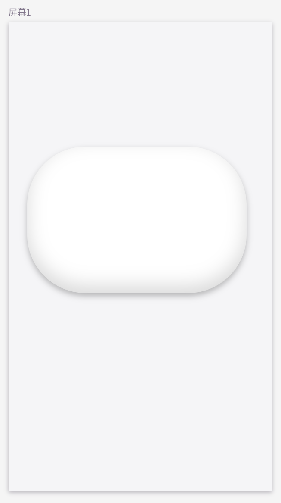
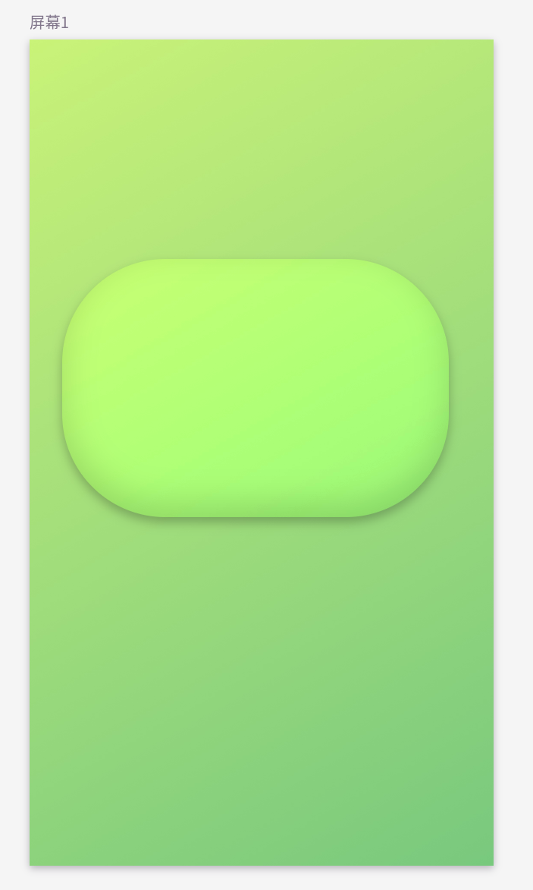
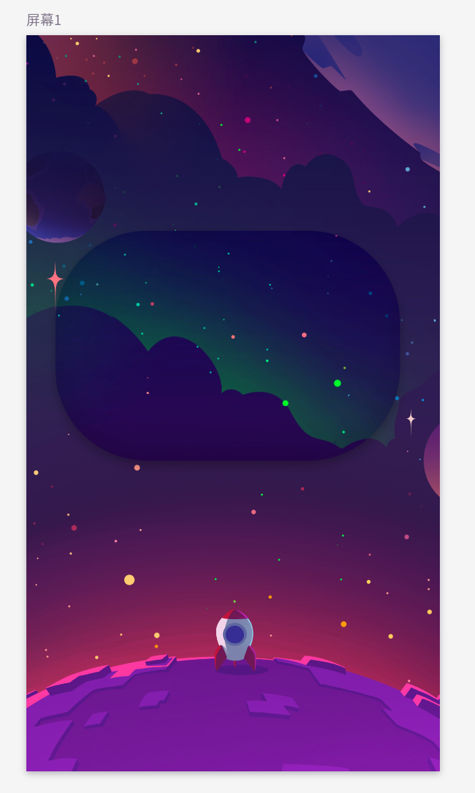
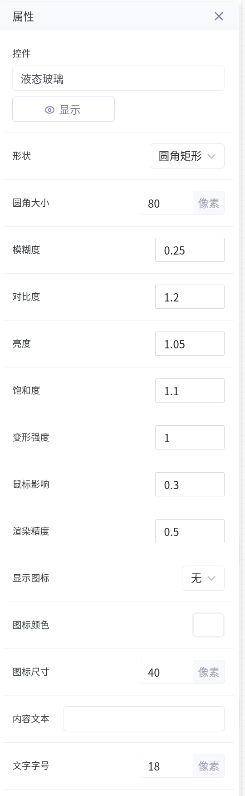
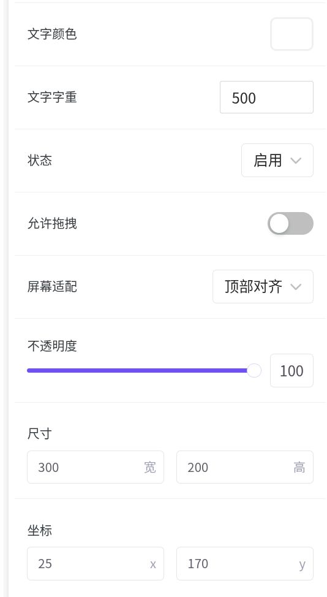
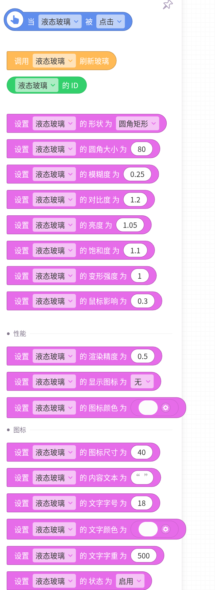
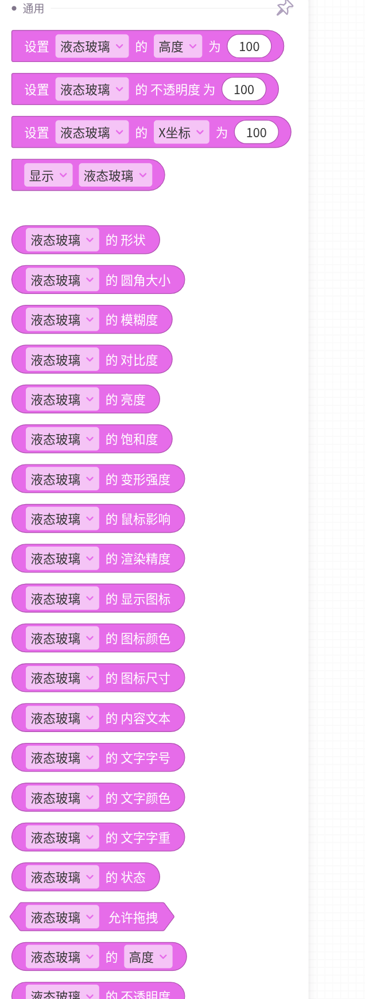
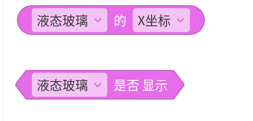

<div align="center">

# CoCo Liquid Glass

**为编程猫 CoCo 编辑器打造的可交互液态玻璃自定义控件**

通过 Canvas 位移贴图与 SVG 滤镜实时折射控件背后的画面，支持形状、光学效果、图标、文字、事件与拖拽等丰富配置。


</div>

## 效果展示

液态玻璃会实时采样并扭曲后方内容。相比纯色背景，在渐变、插画或照片上可以获得更明显的折射效果。

<table>
  <tr>
    <td align="center"></td>
    <td align="center"></td>
    <td align="center"></td>
  </tr>
  <tr>
    <td align="center"><sub>浅色背景</sub></td>
    <td align="center"><sub>渐变背景</sub></td>
    <td align="center"><sub>插画背景</sub></td>
  </tr>
</table>

## 功能特点

- **动态折射**：使用 Canvas 生成位移贴图，并由 SVG `feDisplacementMap` 完成实时变形。
- **鼠标交互**：玻璃折射随指针位置变化，可调整鼠标影响强度。
- **高度可定制**：支持圆形与圆角矩形，以及模糊、对比度、亮度、饱和度等参数。
- **内容丰富**：可显示自定义文字、加号或对勾图标，并分别设置样式。
- **完整事件**：提供点击、悬停、离开事件，可直接连接 CoCo 积木逻辑。
- **性能可控**：渲染精度可调，适配不同设备与作品复杂度。
- **单文件控件**：核心实现集中在一个 JSX 文件中，便于导入、维护和二次开发。

## 快速开始

1. 下载仓库中的 [`cocyper-liquid-glass.jsx`](./cocyper-liquid-glass.jsx)。
2. 在 CoCo 编辑器中打开自定义控件的代码编辑或导入入口。
3. 导入 JSX 文件，并将“液态玻璃”控件添加到屏幕。
4. 在属性面板中调整尺寸、形状和光学参数。
5. 在玻璃控件后方放置渐变、图片或其他内容，即可观察折射效果。

> [!TIP]
> 玻璃本身不会生成背景。后方画面的颜色与细节越丰富，折射效果越明显。

## 属性配置

<details open>
<summary><strong>外观与光学</strong></summary>

| 属性 | 默认值 | 说明 |
| --- | ---: | --- |
| 形状 | `圆角矩形` | 可选圆形或圆角矩形 |
| 圆角大小 | `80 px` | 圆角矩形的圆角半径 |
| 模糊度 | `0.25` | 背景模糊程度 |
| 对比度 | `1.2` | 玻璃区域的背景对比度 |
| 亮度 | `1.05` | 玻璃区域的背景亮度 |
| 饱和度 | `1.1` | 玻璃区域的背景饱和度 |
| 变形强度 | `1` | 位移贴图产生的折射强度 |
| 鼠标影响 | `0.3` | 指针靠近时对局部变形的影响 |

</details>

<details>
<summary><strong>性能</strong></summary>

| 属性 | 默认值 | 说明 |
| --- | ---: | --- |
| 渲染精度 | `0.5` | 位移贴图分辨率倍率；越高越清晰，也越消耗性能 |

</details>

<details>
<summary><strong>图标与文字</strong></summary>

| 属性 | 默认值 | 说明 |
| --- | ---: | --- |
| 显示图标 | `无` | 可选无、加号或对勾 |
| 图标颜色 | 主题按钮文字色 | 设置图标颜色 |
| 图标尺寸 | `40 px` | 设置图标大小 |
| 内容文本 | 空 | 显示在玻璃中央的文字 |
| 文字字号 | `18 px` | 设置文字大小 |
| 文字颜色 | 主题按钮文字色 | 设置文字颜色 |
| 文字字重 | `500` | 设置文字粗细 |

</details>

<details>
<summary><strong>状态与布局</strong></summary>

| 属性 | 默认值 | 说明 |
| --- | ---: | --- |
| 状态 | `启用` | 禁用后降低透明度，并停止触发交互事件 |
| 允许拖拽 | `关闭` | 开启后可在运行时拖动控件 |
| 屏幕适配 | `顶部对齐` | 可选顶部对齐或底部对齐 |
| 不透明度 | `100` | CoCo 通用外观属性 |
| 尺寸 | `300 × 200` | 控件默认宽度与高度 |
| 坐标 | 由编辑器决定 | 控件在当前屏幕中的位置 |

</details>

<p align="center">
  
  &nbsp;
  
</p>

## 积木能力

### 事件

当液态玻璃被**点击**、鼠标**悬停**或鼠标**离开**时，可以触发对应积木逻辑。控件处于禁用状态时不会触发这些事件。

### 方法与返回值

| 积木 | 类型 | 作用 |
| --- | --- | --- |
| `调用 液态玻璃 刷新玻璃` | 方法 | 手动重新生成位移贴图 |
| `液态玻璃 的 ID` | 返回值 | 获取当前控件的唯一 ID |
| `液态玻璃 的 X坐标 / Y坐标` | 返回值 | 获取 CoCo 提供的通用坐标 |
| `液态玻璃 是否显示` | 布尔值 | 获取 CoCo 提供的通用显示状态 |

<p align="center">
  
  &nbsp;
  
</p>

<p align="center">
  
</p>

## 推荐参数

| 使用场景 | 模糊度 | 对比度 | 亮度 | 饱和度 | 变形强度 | 渲染精度 |
| --- | ---: | ---: | ---: | ---: | ---: | ---: |
| 清透按钮 | `0.15` | `1.15` | `1.08` | `1.05` | `0.8` | `0.5` |
| 柔和面板 | `0.4` | `1.1` | `1.05` | `1.0` | `0.7` | `0.5` |
| 强烈折射 | `0.2` | `1.3` | `1.1` | `1.2` | `1.5` | `0.75` |
| 移动设备优先 | `0.25` | `1.2` | `1.05` | `1.1` | `1.0` | `0.35` |

这些值可作为起点。最终效果还会受到控件尺寸、圆角和背景内容影响。

## 性能建议

- 常规项目建议将渲染精度保持在 `0.35` 至 `0.75`。
- 多个玻璃控件同时出现时，优先降低渲染精度和控件尺寸。
- 参数或尺寸批量变化后，可调用“刷新玻璃”积木主动更新效果。
- 若作品运行设备性能有限，避免同时放置过多大尺寸液态玻璃。

## 实现原理

```text
控件尺寸与圆角
      ↓
Canvas 计算圆角矩形 SDF
      ↓
生成 R/G 通道位移贴图
      ↓
SVG feDisplacementMap 扭曲背景
      ↓
backdrop-filter 叠加模糊、对比度、亮度和饱和度
```

鼠标移动时，控件会更新指针相对位置，并通过 `requestAnimationFrame` 合并连续刷新请求，减少不必要的重复渲染。

## 兼容说明

本控件依赖以下浏览器能力：

- Canvas 2D
- SVG Filter 与 `feDisplacementMap`
- CSS `backdrop-filter`
- `requestAnimationFrame`

实际显示效果可能因 CoCo 运行环境、浏览器内核和设备性能而略有差异。若背景折射不明显，请先确认玻璃后方存在可见内容，并适当提高变形强度。

## 项目结构

```text
COCO-Liquid-Glass/
├── cocyper-liquid-glass.jsx   # 控件源码
├── images/
│   ├── 可调参数1.png          # 属性面板截图
│   ├── 可调参数2.png
│   ├── 积木块1.png            # 积木截图
│   ├── 积木块2.png
│   ├── 积木块3.png
│   ├── 效果图1.png            # 效果预览
│   ├── 效果图2.png
│   └── 效果图3.png
├── LICENSE
└── README.md
```

## 致谢

控件的液态玻璃渲染思路基于 Shu Ding 的 Liquid Glass Vanilla JS 实现，并针对 CoCo 自定义控件环境进行了适配。

## 开源许可

本项目采用 [MIT License](./LICENSE) 开源。

Copyright © 2026 YooStack Studio
